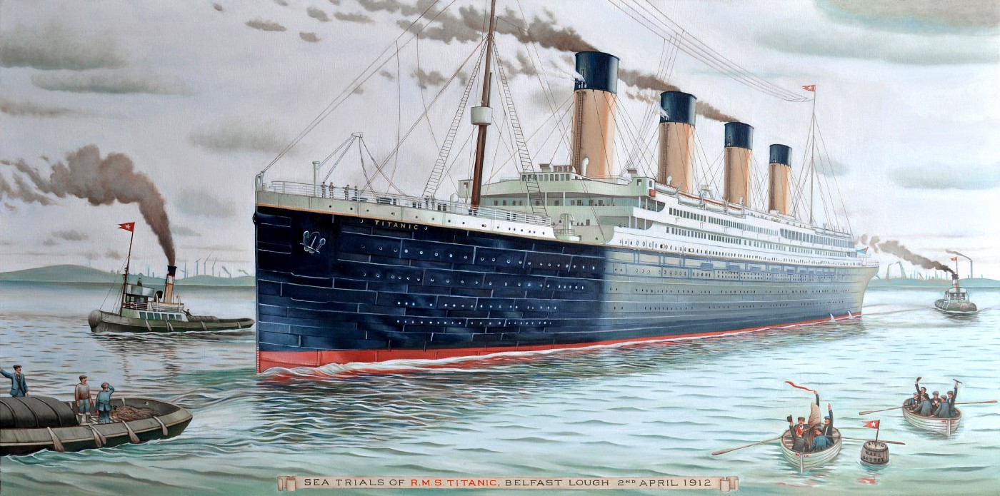

# Ejercicios Ufro 
Repositorio pensado a modo de ejemplo para la comunidad de la UFRO, con fines didacticos/introductorios a diversos temas del analisis de datos.

## [Pronosticando el número de manchas solares](https://github.com/HYP03/Sun_spots)
Este repositorio incluye el ajuste de un modelo ARMA para pronosticar el núméro de manchas solares. 

## [Predictor sobrevivientes Titanic](https://github.com/HYP03/Titanic_prj)
Este repositorio presenta un acercamiento a multiples clasificadores a modo de ejempplo para la competicion Titanic de Kaggle

## [Predictor Alzheimer](https://github.com/HYP03/Deteccion_Alzheimer/blob/main/Proj1.html)
Este repositorio presenta un acercamiento a multiples clasificadores para la prediccion temprana del Alzheimer

---
