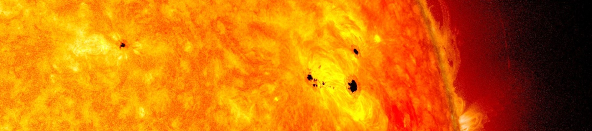

# Ejercicios Ufro 
Repositorio pensado a modo de ejemplo para la comunidad de la UFRO, con fines didacticos/introductorios a diversos temas del analisis de datos.

## [Pronosticando el número de manchas solares](https://github.com/HYP03/Sun_spots)
Este repositorio incluye el ajuste de un modelo ARMA para pronosticar el núméro de manchas solares. 

---
